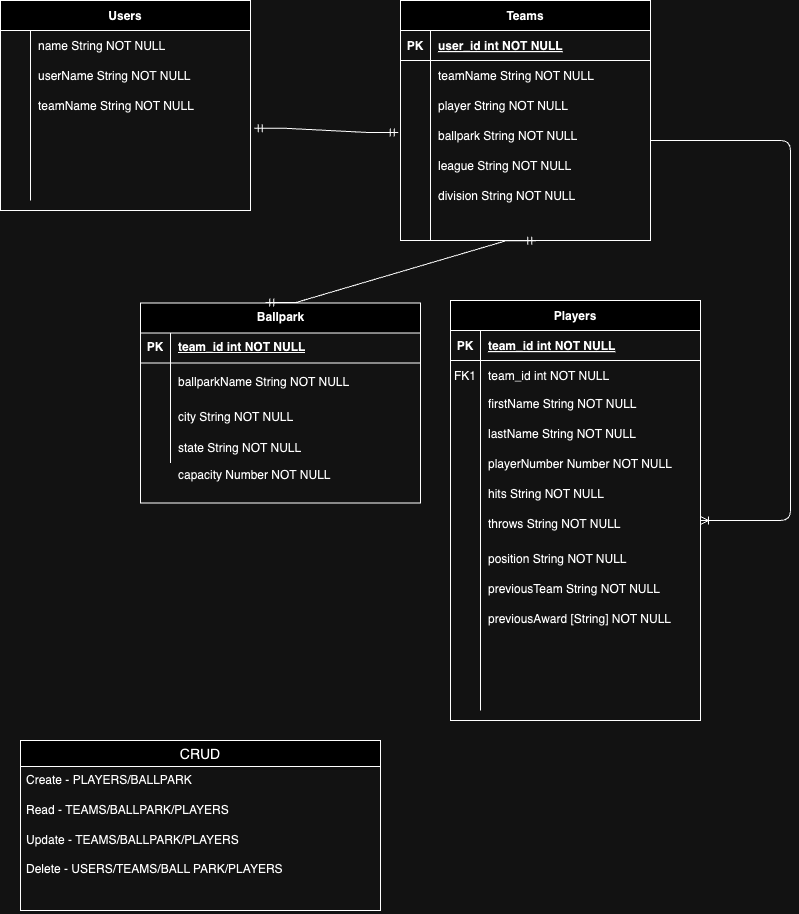
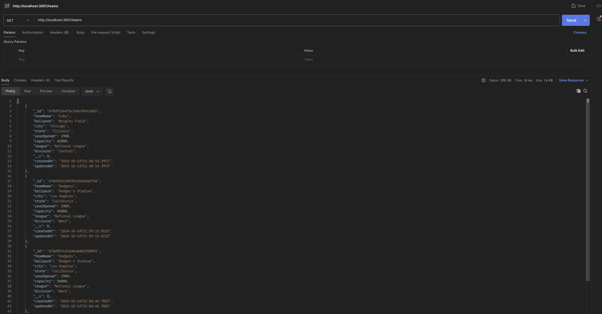
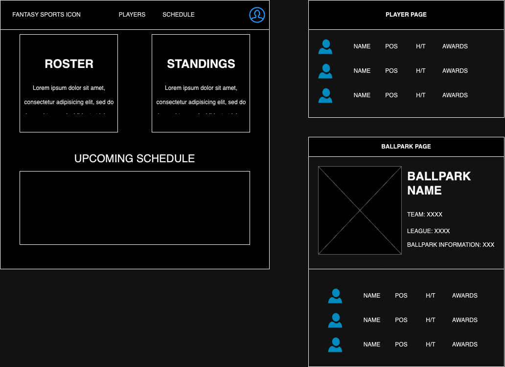

# baseball-full-stack
A full stack application using MEN (Mongoose, Express, NodeJS). Application will allow CRUD operations and supply stats on each player and team entered into the database.

# APPLICATION DESCRIPTION
This application main focus is building an indepth API that will allow registered users to create a roster of teams they manage. This will include what ballparks they play at, the players on their teams and the necessary information about each player. As this project grows it will include a scoring engine. The engine included will allow the user who manages a team to control the outcome from a game for their team. This will include input for game actions, registering events that happen in the field when the team is on defense as well as game actions for whent hey're on offense. 

The application will take on a third ability which will be to include an fantasy sports game engine. This engine will focus on fantasy points that users who subscribe to certain players will recieve when that player has any positive, or negative, game action.

# CRUD

The CRUD that will be included in the application will be:

CREATE: Create user profile, create the team you'll manage including players and ballpark
READ: There will be a dashboard that will display all necessary aspects of the application
UPDATE: The user will be able to update the players information and ballpark on the team they manage.
DELETE: The user will be able to delete players, ballpark and even their account all together. 

# ERD

# SAMPLE DATA CALL

# SITE WIREFRAME

